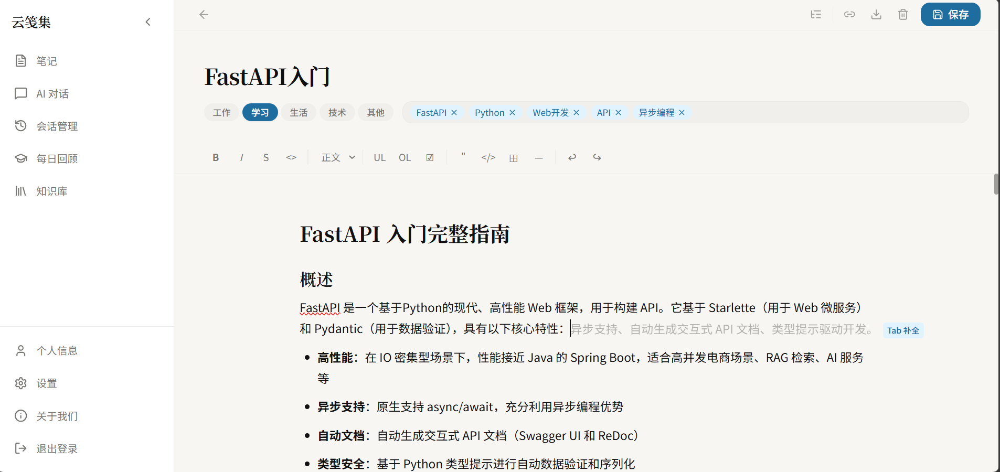
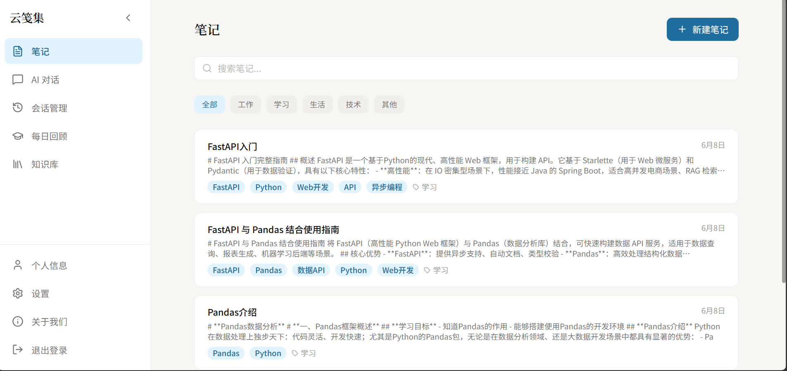
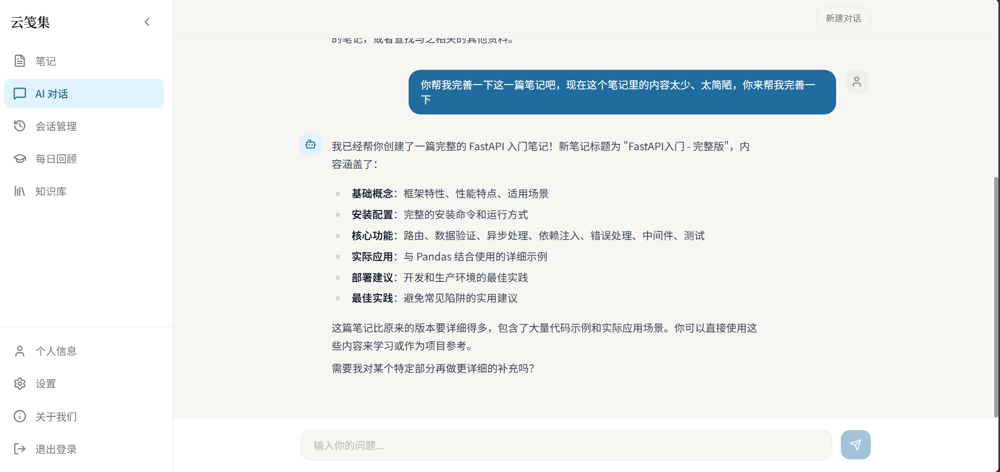
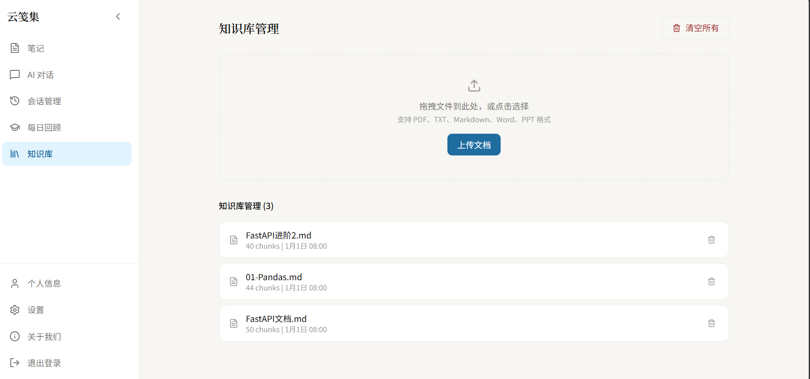

# 云舒卷（RAG Notebook）— AI 驱动的个人知识管理平台

把 **笔记、知识库、AI 对话、间隔回顾** 串成完整学习闭环，并带有页宠养成与轻社交能力——解决"笔记写了从不回看、知识散落成孤岛"的问题。

> 📋 全部功能与优化汇总：见 [`plan/2026-08-27-COMPLETED-OPTIMIZATIONS.md`](./plan/2026-08-27-COMPLETED-OPTIMIZATIONS.md)

---

## 项目变迁

本项目最初是一个**基础 RAG 对话系统**，我们做了一次重要转型，从基础的 RAG，转型为解决实际问题的 RAG Notebook：

|                  | 阶段一（base-rag 分支）                            | 阶段二（master 分支）                                   |
| ---------------- | -------------------------------------------------- | :------------------------------------------------------ |
| **定位**   | 纯 RAG 对话服务，开箱即用                          | 智能笔记助手，以 RAG 为核心的 NoteBook 工具             |
| **能力**   | 文档上传 → 向量检索 → AI 问答                    | 笔记管理 + RAG + 间隔重复 + AI 写作                     |
| **适合谁** | 想快速集成 RAG 能力的开发者或希望学习RAG技术的个人 | 需要AI管理笔记和知识库的个人以及简历需要RAG项目的求职者 |

**RAG 始终是整个系统的核心引擎。** 基础 RAG 代码已永久保留在 `base-rag` 分支供学习使用，如果只需要纯 RAG 服务，切换到`base-rag`即可开箱使用。

## 📋 目录

- [项目简介](#项目简介)
- [项目变迁](#项目变迁)
- [核心特性](#核心特性)
- [项目架构](#项目架构)
- [项目演示](#项目演示)
- [快速开始](#快速开始)
- [技术栈](#技术栈)
- [项目结构](#项目结构)
- [API 文档](#api文档)
- [配置说明](#配置说明)
- [部署指南](#部署指南)
- [开发指南](#开发指南)
- [故障排除](#故障排除)
- [联系方式](#联系方式)

## 项目简介

基于 **FastAPI + React 19** 的全栈知识管理应用，核心是"**记录 → 检索 → 回顾 → 分享**"闭环：

- **记**：Tiptap 编辑器写 Markdown 笔记，支持双链 `[[标题]]`、标签分类、模板、批量操作
- **问**：Agent + RAG 检索增强问答，SSE 流式输出思考过程与引用来源
- **忆**：艾宾浩斯间隔回顾 + AI 自动出题，搭配番茄钟与连续打卡
- **养**：页宠「小卷」好感度养成，与全平台行为联动（写笔记/回顾/对话/发动态/番茄钟都涨好感，数据云端同步）
- **社交**：笔记公开分享页、好友动态流（朋友圈）、知识广场、排行榜、个人主页成就墙

技术亮点：自绘 SVG 数据可视化（写作热力图/环形图/趋势图）、d3-force 知识图谱、ChromaDB 向量检索 + BM25 混合检索 + 重排序、LLM 异步内容审核、Redis 缓存自动降级、JWT 用户隔离。

## 核心特性

**知识管理**
- 📝 **笔记管理**：Markdown 编辑器（Tiptap）、标签/分类筛选、置顶、批量操作、笔记模板、Markdown/HTML 导出与打印
- 🔗 **双链**：`[[标题]]` 语法自动建链 + 反向链接面板
- 🏷️ **智能标签**：保存笔记后 LLM 异步生成标签和分类，无需手动归类
- 🔍 **语义搜索**：ChromaDB 向量检索 + 知识库混合检索（BM25 + 重排序）
- 🧠 **间隔重复回顾**：艾宾浩斯遗忘曲线（1/2/4/7/15/30 天）+ LLM 自动出题
- ✍️ **AI 写作辅助**：联机补全（Tab 采纳）、续写/扩写/摘要，SSE 流式输出

**数据可视化**
- 📊 **知识仪表盘**：GitHub 风格 365 天写作热力图、30 天字数趋势、分类环形图、年度统计（全部自绘 SVG，零图表库依赖）
- 🕸 **知识图谱**：d3-force 力导向图，双链 + 语义相似边，Top 50 节点

**分享与社交**
- 📤 **公开分享**：笔记一键公开 → 免登录分享页 + 浏览计数 + Canvas 知识卡片图（三模板 PNG）
- 👥 **好友与动态**：好友申请/关注、动态流（图文/引用笔记/点赞评论）、站内通知红点
- 🏛 **知识广场**：公开笔记流 + 排行榜（写作/回顾/连续写作）
- 🏆 **个人主页**：成就墙（7 枚徽章）、粉丝/关注、公开笔记

**效率与养成**
- 🍅 **番茄钟**：25+5 循环 + 环形进度 + 页宠联动
- ⌘K **命令面板**：搜索笔记/跳转页面/快捷操作；全局快捷键（Ctrl+N 新建笔记）
- 🐾 **页宠「小卷」**：9 种情绪、拖拽、好感度等级（50/150）、自定义形象/颜色/昵称、成就与互动记录，**养成数据云端同步（换设备不丢）**

**工程能力**
- 🔐 用户级数据隔离（JWT）；内容双层审核（敏感词即时拦截 + LLM 异步复核）
- 💾 会话持久化（MySQL）；Redis 缓存（不可用自动降级）；限流 + 后台任务信号量保护模型服务
- 🌐 前端 i18n 中英双语；明暗主题；侧边栏分组折叠动画

## 项目演示

| 功能模块 | 界面展示                                  |
| -------- | :---------------------------------------- |
| 笔记编辑 |      |
| 笔记列表 |             |
| AI 聊天  |            |
| 知识库   |  |

## 快速开始

### 环境要求

| 环境    | 版本推荐 |
| ------- | -------- |
| Python  | 3.12+    |
| uv      | 0.11.9   |
| Node.js | 16+      |

### 克隆项目

```bash
git clone https://github.com/RMA-MUN/LangChain-RAG-FastAPI-Service.git
cd LangChain-RAG-FastAPI-Service
```

### 安装依赖

#### 后端依赖

```bash
cd backend
uv sync
```

#### 前端依赖

```bash
cd front
npm install
```

### 环境配置

#### 创建后端环境变量文件

在 `backend` 目录下创建 `.env` 文件，参考 `.env.example` 文件填写配置：

```env
# ==================== 对话模型（OpenAI 兼容协议，必填） ====================
# 任意兼容服务：OpenAI / DeepSeek / 百炼 compatible-mode / 智谱 / Moonshot / vLLM / Ollama /v1
OPENAI_BASE_URL=https://dashscope.aliyuncs.com/compatible-mode/v1
OPENAI_API_KEY=your_api_key
OPENAI_MODEL_NAME=qwen3-max

# ==================== 视觉模型（可选能力；默认关闭） ====================
# 留空则整体回落 OPENAI_*；仅配 base_url 不配 api_key 不会被补全（视觉将降级关闭）
VISION_ENABLED=false
# VISION_BASE_URL=
# VISION_API_KEY=
# VISION_MODEL_NAME=qwen-vl-max

# ==================== 嵌入模型（可选能力；留空整体回落 OPENAI_*） ====================
# EMBED_BASE_URL=
# EMBED_API_KEY=
# EMBED_MODEL_NAME=text-embedding-v3

# ==================== 数据库配置 ====================
MYSQL_USER=root
MYSQL_PASSWORD=root
MYSQL_HOST=localhost
MYSQL_PORT=3306
MYSQL_DATABASE=chat_history

REDIS_HOST=localhost
REDIS_PORT=6379
REDIS_DB=0

# ==================== 重排序模型配置 ====================
RERANKER_MODEL_PATH=D:\Hugging_Face\models\bge-reranker-v2-m3

# ==================== JWT 身份验证配置 ====================
SECRET_KEY=MY_JWT_SECRET_KEY
ALGORITHM=HS256
```

> 💡 **跨平台混搭**：对话、视觉、嵌入三个模型可以来自三个不同平台（各自独立的三件套）。
> 例如：对话=DeepSeek（`OPENAI_BASE_URL=https://api.deepseek.com/v1` + `OPENAI_MODEL_NAME=deepseek-chat`）、
> 视觉=百炼 qwen-vl-max、嵌入=Ollama 本地（`EMBED_BASE_URL=http://localhost:11434/v1` + `EMBED_API_KEY=ollama`）。
> 注意：不要只配 `VISION_BASE_URL` 或 `EMBED_BASE_URL` 而漏配对应的 `API_KEY`——部分配置不会被回落补全，
> 避免跨供应商混用凭据（视觉会降级关闭，嵌入会报错）。

### 向量数据库配置

修改 `backend/app/config/chroma.yaml` 文件：

```yaml
collection_name: rag_collection
persist_directory: data/chromadb
k: 3

data_path: data
md5_hex_store: data/md5_hex_store/md5_hex_store.txt
allow_knowledge_file_types: ["txt", "pdf", "md", "pptx", "docx"]

chunk_size: 200
chunk_overlap: 20
separators: ["\n\n", "\n", "。", "！", "？", "!", "?", " ", ""]
```

### 启动服务

| 服务     | 命令                                        | 端口 |
| -------- | ------------------------------------------- | ---- |
| 后端（开发） | `cd backend && .venv\Scripts\python.exe -m uvicorn main:app --reload --port 8000` | 8000 |
| 后端（生产） | `cd backend && .\start_prod.ps1`（4 workers） | 8000 |
| 前端服务 | `cd front && npm run dev`                 | 3000 |

| MySQL | `net start mysql` | 3306 |
| Redis | `Start-Service rediszt3`（本机服务名）或 `redis-server` | 6379 |
| Ollama | `ollama serve`（可选，本地嵌入/对话） | 11434 |

> ⚠️ 测试账号：`admin / admin1234`（另有 `admin2` 可体验好友/关注）

## 技术栈

### 后端技术

| 技术       | 说明                                                  |
| ---------- | ----------------------------------------------------- |
| FastAPI    | 高性能异步 Web 框架                                   |
| LangChain  | 大语言模型应用开发框架（AgentExecutor + Tools）       |
| ChromaDB   | 轻量级向量数据库（rag_collection + notes_collection） |
| SQLAlchemy | 异步 ORM，管理 MySQL                                  |

| MySQL | 关系型数据库（chat_history / notes / reviews） |
| Redis | 缓存 |
| DashScope API 等任意 OpenAI 兼容服务 | 云端大模型（百炼 / DeepSeek / OpenAI / 智谱 / Moonshot / vLLM，通过统一 OpenAI 兼容协议接入） |
| Ollama | 本地模型部署（OpenAI 兼容 /v1 端点） |
| Hugging Face / ModelScope | 重排序模型（BAAI/bge-reranker-v2-m3） |
| Sentence-Transformers | 句子嵌入模型 |

### 前端技术

| 技术                              | 说明                            |
| --------------------------------- | ------------------------------- |
| React 19                          | 现代化前端框架                  |
| TypeScript                        | 类型安全                        |
| Vite 8                            | 极速构建工具                    |
| Tailwind CSS 4                    | 原子化 CSS 框架（CSS-first 配置） |
| Radix UI                          | 无头 UI 组件库                  |
| Tiptap                            | 富文本 Markdown 编辑器          |
| React Router 7                    | 路由管理（懒加载 + JWT 校验）   |
| Zustand                           | 轻量状态管理                    |
| framer-motion                     | 动画（页面入场/侧边栏折叠）     |
| d3-force                          | 知识图谱力导向布局              |
| i18next                           | 国际化（中/英）                 |
| Axios                             | HTTP 客户端                     |
| react-markdown + rehype-highlight | Markdown 渲染与代码高亮         |
| dompurify                         | HTML 安全过滤                   |

## 项目结构

```
├── backend/                     # FastAPI 后端服务
│   ├── app/
│   │   ├── agent/               # Agent 智能代理模块
│   │   │   └── agent.py         # AgentFactory + Tool 定义
│   │   ├── config/              # 配置文件（chroma.yaml 等）
│   │   ├── core/                # 核心工具（限流、响应封装、日志）
│   │   ├── db/                  # 数据库配置（MySQL + Redis）
│   │   ├── model/               # SQLAlchemy ORM 模型
│   │   │   ├── note.py          # 笔记模型
│   │   │   ├── review_record.py # 回顾记录模型
│   │   │   └── chat_history.py  # 对话历史模型
│   │   ├── prompt/              # 提示词模板（8个）
│   │   ├── rag/                 # RAG 核心功能
│   │   │   ├── rag_service.py   # RAG 服务（HyDE + 混合检索）
│   │   │   ├── reorder_service.py
│   │   │   ├── vector_store.py  # ChromaDB 封装
│   │   │   ├── text_spliter.py  # 文档切片
│   │   │   ├── document_handler/# 文档解析（txt/pdf/md/pptx/docx）
│   │   │   ├── retrievers/      # 自定义检索器
│   │   │   └── task_queue.py    # 后台处理队列
│   │   ├── router/              # API 路由
│   │   │   ├── chat.py          # 聊天 & Agent 路由
│   │   │   ├── note_router.py   # 笔记 CRUD & AI 路由（含双链/图谱）
│   │   │   ├── social_router.py # 社交（好友/动态/通知/广场/个人主页）
│   │   │   ├── stats_router.py  # 仪表盘统计 + 排行榜
│   │   │   ├── share_router.py  # 公开分享页 + /public 数据 API
│   │   │   ├── review_router.py # 间隔重复回顾路由
│   │   │   ├── knowledge_router.py
│   │   │   ├── user.py
│   │   │   └── health.py
│   │   ├── models/              # SQLAlchemy ORM 模型（note/social/user_model 等）
│   │   ├── schemas/             # Pydantic 数据模型
│   │   ├── services/            # 业务服务层
│   │   │   ├── note_service.py  # 笔记服务（CRUD + 向量化 + AI 写作 + 双链）
│   │   │   └── review_service.py# 回顾服务（艾宾浩斯算法）
│   │   └── utils/               # 工具函数
│   ├── data/                    # 数据存储目录
│   ├── main.py                  # 应用入口
│   ├── start_prod.ps1           # 生产多 worker 启动脚本
│   └── pyproject.toml
├── front/                       # React 前端项目
│   ├── src/
│   │   ├── api/                 # API 请求层
│   │   │   ├── auth.ts          # 认证接口
│   │   │   ├── chat.ts          # 聊天接口
│   │   │   ├── notes.ts         # 笔记接口
│   │   │   ├── knowledge.ts     # 知识库接口
│   │   │   ├── review.ts        # 回顾接口
│   │   │   └── sessions.ts      # 会话接口
│   │   ├── components/          # 组件
│   │   │   ├── common/          # 通用组件（TagBadge, ConfirmDialog, EmptyState 等）
│   │   │   ├── knowledge/       # 知识库组件
│   │   │   ├── layout/          # 布局组件（Sidebar）
│   │   │   ├── note/            # 笔记组件（OutlinePanel, RelatedFragments）
│   │   │   └── TiptapEditor.tsx # 富文本编辑器
│   │   ├── hooks/               # 自定义 Hooks
│   │   │   └── useSSE.ts        # SSE 流式处理
│   │   ├── i18n/                # 国际化（中/英）
│   │   ├── layouts/             # 页面布局（AuthLayout, MainLayout）
│   │   ├── pages/               # 页面
│   │   │   ├── NoteEditor.tsx   # 笔记编辑器（双链/分享/导出/卡片）
│   │   │   ├── NoteList.tsx     # 笔记列表
│   │   │   ├── DailyReview.tsx  # 每日回顾
│   │   │   ├── AIChat.tsx       # AI 聊天
│   │   │   ├── Sessions.tsx     # 会话管理
│   │   │   ├── KnowledgeBase.tsx# 知识库管理（含网页剪藏）
│   │   │   ├── StatsPage.tsx    # 知识仪表盘
│   │   │   ├── GraphPage.tsx    # 知识图谱
│   │   │   ├── PlazaPage.tsx    # 知识广场 + 排行榜
│   │   │   ├── SocialFeed.tsx   # 动态流
│   │   │   ├── FriendsPage.tsx  # 好友
│   │   │   ├── NotificationsPage.tsx # 通知
│   │   │   ├── UserProfilePage.tsx   # 个人主页（成就墙/关注）
│   │   │   ├── PublicSharePage.tsx   # 公开分享页（免登录）
│   │   │   ├── PomodoroPage.tsx # 番茄钟
│   │   │   ├── HabitPage.tsx / PetPage.tsx
│   │   │   ├── Login.tsx / Register.tsx
│   │   │   ├── Profile.tsx / Settings.tsx
│   │   │   └── AboutUs.tsx
│   │   ├── router/index.tsx     # 路由配置
│   │   ├── stores/              # Zustand 状态管理
│   │   │   ├── useUserStore.ts / usePetStore.ts / useHabitStore.ts
│   │   │   ├── useThemeStore.ts / useLanguageStore.ts
│   │   ├── hooks/               # useSSE / useSettingsSync（养成数据上云）
│   │   ├── types/api.ts         # TypeScript 类型定义
│   │   ├── App.tsx              # 应用入口组件
│   │   └── main.tsx             # 应用入口
│   └── package.json
├── deploy/                       # 生产部署示例（nginx.conf.example）
├── docs/                        # 项目文档
│   ├── modelscope_model.md     # 模型下载和配置
│   └── troubleshooting.md      # 故障排除
├── images/                      # 截图资源
└── plan/                        # 项目规划与交接文档
    ├── 2026-08-27-COMPLETED-OPTIMIZATIONS.md  # 全部优化汇总
    ├── 2026-08-27-HANDOFF-NEXT-AGENT.md       # 开发交接文档
    ├── 2026-08-27-scale-up-plan.md            # 高并发升级路线
    └── 2026-08-26-feature-expansion-plan.md   # 六方向企划
```

## API 文档

### FastAPI 后端 API

完整的 OpenAPI 规范文件：[backend/openapi.json](./backend/openapi.json)
		启动服务后访问交互式文档：[http://localhost:8000/docs](http://localhost:8000/docs)

## 配置说明

### LLM 模型配置（统一 OpenAI 兼容协议）

系统通过 **OpenAI 兼容协议**接入任意大模型服务，不绑定特定厂商。对话、视觉、嵌入三个能力各自独立配置，支持跨平台混搭：

| 能力 | 配置项 | 说明 |
| --- | --- | --- |
| 对话（必填） | `OPENAI_BASE_URL` / `OPENAI_API_KEY` / `OPENAI_MODEL_NAME` | 任意兼容服务（百炼 / DeepSeek / OpenAI / 智谱 / Moonshot / vLLM / Ollama） |
| 视觉（可选） | `VISION_ENABLED` / `VISION_BASE_URL` / `VISION_API_KEY` / `VISION_MODEL_NAME` | 默认关闭；`VISION_*` 全空时整体回落 `OPENAI_*` |
| 嵌入（可选） | `EMBED_BASE_URL` / `EMBED_API_KEY` / `EMBED_MODEL_NAME` | 留空时整体回落 `OPENAI_*` |

**回落规则是"原子"的**：仅当某能力的 base_url 与 api_key **两者都未设置**时才整体回落 `OPENAI_*`，绝不把不同平台的 url 与 key 混搭，避免部分配置时静默使用错误供应商的凭据。

### 重排序模型

下载 BAAI/bge-reranker-v2-m3 模型并配置 `RERANKER_MODEL_PATH` 路径，参考 [模型配置指南](./docs/modelscope_model.md)。

## 故障排除

详细的故障排除指南请参考：[故障排除](./docs/troubleshooting.md)

常见问题：

- **API Key 错误**：检查 OPENAI_API_KEY（或 VISION_API_KEY / EMBED_API_KEY）是否正确配置，且 base_url 与 api_key 属于同一平台
- **数据库连接失败**：确认 MySQL / Redis 服务已启动
- **ChromaDB 异常**：检查 `chroma.yaml` 中的路径配置
- **重排序模型加载失败**：确认 `RERANKER_MODEL_PATH` 指向正确的模型路径
- **Ollama 连接失败**：确认 `ollama serve` 已运行且模型已拉取

## 联系方式

如有任何问题或建议，欢迎提交 GitHub Issues 或联系作者：

- Email: n3032747608@163.com
- QQ: 3032747608

## Star History

<picture>
   <source media="(prefers-color-scheme: dark)" srcset="https://star-history.dera.page/svg?repos=RMA-MUN/RAGNotebook&type=date&theme=dark&legend=top-left" />
   <source media="(prefers-color-scheme: light)" srcset="https://star-history.dera.page/svg?repos=RMA-MUN/RAGNotebook&type=date&legend=top-left" />
   
 </picture>

## License

本项目基于MIT开源协议， [点击跳转LICENSE](LICENSE)
